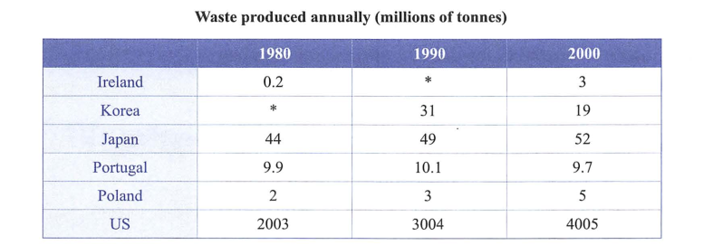

# IELTS Writing Task 1 Dynamic Graph

参考（抄袭）顾家北6.0

## 1. 线图 Line Graph (past time)

> *The graph below shows the quantities of goods transported in the UK between 1974 and 2002 by four different modes of transport.*
>
> *Summarize the information by selecting and reporting the main features, and make comparisons where relevant.*

注意要点：

* 一般过去时
* 描述对象是运输方式，对比年代
* 分段：开头，比较高的一段，比较低的一段，总结一段
* 总结：基本所有运输方式都上升，只有rail有下降趋势，而road比其他的领先很多，更普遍

段落内容：

* 开头，同义词替换复述题目
* 第一段：road最高，且有明显的上升趋势（上升的很快，注意形容）；而water其次（比road偏低），但趋势比较平缓，在一段时间内有所保持
* 第二段：相比之下，其他的都比较低；rail成起伏趋势，最后有略微上升，而pipeline有缓慢上升，最后趋于平稳

The graph compares the volumes of goods delivered by four means of transport in the UK during the period 1974 to 2002.

* 有比较，用compare
* transport用deliver替换，修饰good
* by 4 means of transport 给出比较对象
* during the period 1974 to 2002 是一个很好的表述时间的方式

The amount of goods transported by road was the largest, with around 70 million tonnes in 1974. It sharply increased to about 100 million tonnes in 2002. The figure for water was lower throughout the period: it rose from around 40 million tonnes in 1974 to about 58 million tonnes in 1980 and then stood at this level until 1998, before climbing to over 65 million tonnes in 2002.

* amount, figure可以指代数量；首先是amount for goods，其次是figure for water，保持词汇多样性
* largest形容数量最多
* around, about, approximately, near, over ...用来估计数值
* sharply increased，快速增长；rise from ... to ...；climb to
* the figure was lower throughout the period 与road作了对比
* stand at this level 保持稳定，不变化

The amounts of goods transported by the other two means of transport were lower. There was a dramatic fall in the figure for rail transportation from around 40 million tonnes on 1974 to 30 million tonnes in 1984, although it increased to over 40 million tonnes in 2022. The pipeline for transporting goods saw a steady growth from approximately 5 million tonnes in 1974 to over 20 million tonnes in 1995, and then it remained at this level in the rest of the period. Despite the growth, it was the least popular means of transport.

* 首先进行了分段的对比（分类），rail和pipeline明显比上面两者低很多
* there was a dramatic fall in the figure for ... from 1974 to 1984, although it increased to ... 很好地一句话讲完了一整个内容
* saw a steady growth from ... to ...
* remain at this level in the rest of the period
* 由于其最低但是缓慢上升的特性，使用despite连接，用least popular形容最少

Overall, almost every means of transport in UK saw an upward trend in the goods delivery, while there was a different pattern in rail. Road transportation delivered more goods than any other means of transport.

* see an upward trend in ...
* while there was a different pattern in ...
* deliver more goods than any other means of transport

提升的范文：

The graph compares the volumes of goods delivered by four means of transport in the UK during the period 1974 to 2002.

Road was by far more important mode of transport, with the figure increasing modestly from 70 million to approximately 80 million in 1994 and then rising even at a faster pace during the rest of the period to nearly 100 million tonnes in 2002. The amount of goods transported by water was lower: while it did record a significant growth from 40 million to 70 million tonnes in 2002, the figure remained basically unchanged between 55 and 60 million tonnes for nearly two decades from 1982 to 1998.

By comparison, there was a dramatic fall in the figure for rail transportation from 40 million tonnes in 1974 to 30 million tonnes in 1984, although it climbed back to over 40 million tonnes in 2002. The amount of goods  delivered by pipeline recorded a steady growth from approximately 5 million tonnes in 1974 to over 20 million tonnes in 1995, and then remained at this level in the rest of the period. Despite the growth, it was the least popular means of transport.

Overall, almost every means of transport in UK saw an upward trend in the goods delivery with rail as the only exception. Road transportation delivered more goods than any other means of transport.

## 2. 线图（有预测值）

> *The graph below gives information from a 2008 report about consumption of energy in the USA since 1980 with projections until 2030.
> Summarise the information by selecting and reporting the · main features and make comparisons where relevant.*

注意要点：

* 一般过去，将来时
* 六种能源是描述的对象，时间是对比的对象
* the amount of energy produced by petrol and oil
* 分段：三个较高的写一段，其他三个写一段
* 总结：Petrol and oil是最高的，所有能源都基本上升了，除了Hydropower

段落内容：

* 开头段：改写题目
* 第一段：petrol and oil是最主要的能源，稳步上升并且有望在2030达到50；与petrol and oil 类似，coal也有一个相似的上升趋势，预计成为第二主要的能源；natural gas在经历波动之后，预计在剩下的时间里维持不变。
* 第二段：相比之下，新能源的消耗就小得多；nuclear 和 solar/wind 缓慢上升，而hydropower波动之后略微下降。
* 总结段：petrol and oil 是最高的，所有能源的消耗都基本上升，除了hydropower有轻微下降

The line graph shows the use of different sources of energy in the US over a 50-year period between 1980 and 2030.

* over a 50-year period between 1980 and 2030

Petrol and oil are the most important energy sources from 1980 to 2030. The consumption of these two fuels increased steadily and is expected to grow to 50 quadrillion units in 2030. There will be a similar trend in the consumption of coal, rising from around 17 q in 1980 to 30 q in 2030. It will become the second most important fuel. The consumption of natural gas saw a slight increase to about 25 q units in 2015 and will remain at this level in the rest of the period 

* the most important energy sources形容消耗量大，也就是最重要
* increase steadily, grow to ...
* There will be a similar/different trend in the ... of ...
* rise from ... to ...
* remain/stand at this level in the rest of the period

In contrast, the consumption of new energy sources, including nuclear, solar/wind and hydropower, is much lower. There will be a steady rise to nearly 9 quadrillion in nuclear consumption in 2030.  The consumption of solar/wind will climb to over 5 quadrillion, while the figure for hydropower is predicted to fall to around 3 quadrillion.

* In contrast, ... is much lower
* There will be a steady rise to nearly 9 quadrillion in ...
* The consumption of ... will climb to over 5 quadrillion
* the figure for ... is predicted to fall to around 3 quadrillion

Overall, fossil fuels will still be more important than environment-friendly alternative in the US. The energy production for all resources is expected to rise to various degrees, whereas the use of hydropower will show a different pattern.

* ... than alternative同一种类型的，用alternative代替
* rise to various degrees
* whereas
* show a different pattern

## 3. 饼图（出现百分比）

> Surveys conducted in 1982 and 2002 show different pictures of what motivate students to choose a college or university in the UK.
> Summarise the information by selecting and reporting the main features and make comparisons where relevant.

注意要点：

* 时态：一般过去时
* 描述对象是6个因素，对比对象是两个年份
* 对象词：the proportion of students who paid attention to suitable courses and degrees
* 分段：三个下降的因素写一段，剩下的因素写一段
* 总结：suitable courses and degrees 仍然是首要考虑的因素。Amenities social activities and sports facilities 和 reputation of the institution 变得重要，其他因素基本不变或下降

段落内容：

* 开头段：饼图比较了影响学生们选择不同大学（UK）因素的变化
* 第一段：courses and degree是最主要的因素，但是却有所下降；costs在1982仅低于courses，也有相似的下降趋势；location也从19%下降到16%。
* 第二段：相反的是，reputation大幅上升；同样的变化发生在amenities，上升幅度很大；admission criteria基本保持不变。
* 总结段：suitable courses and degrees 仍然是首要考虑的因素。Amenities social activities and sports facilities 和 reputation of the institution 变得重要，其他因素基本不变或下降

The charts present the findings of a survey about what British students considered when choosing an university in two different years.

Pie charts compare the factors that students considered when choosing a university in the UK in two different years. 

* present the findings of a survey about ...
* compare the factors ...

suitable courses and degrees were the most popular consideration, although the proportion of students who cited this reason dropped from 40% to 34%. The percentage of students who considered costs was the second highest, but there was a sharp decrease to 5%. Similar change happened to location factor either. The figure for those considering the distance to parental home declined from 19% to 16%.

* the most popular
* drop/decline from ... to ..., (sharp) decrease
* plummet = sharply decline

In contrast, the proportion of students who paid attention to the reputation of the university was as low as 5% in 1982, but this factor saw a significant rise to 25%. There was a remarkable change in the percentage of people who valued amenities, social activities and sports facilities, rising from 5% to 18%. The figure for admission criteria remained basically unchanged(3% in 1982 and 2% in 2002).

* see a significant rise
* remarkable change
* consider, value

Overall, more students considered suitable courses and degrees than those who focused on other factors. The percentages of students who considered fame of the university or amenities and sports facilities increased, while the figures for other factors showed opposing trends.

* show opposing trends

## 4. 表格

> *The table shows the amount of waste produced by different countries in 1980, 1990 and 2000.
> Summarise the information by selecting and reporting the main features, and make comparisons where relevant.*

注意要点：

* 时态：过去
* 描述对象是国家，对比对象是年份
* the amount of waste produced
* 分段：比较高的三个写一段，剩下写一段
* 总结：美国最高，其他国家相对较低；除了韩国葡萄牙基本都增加了。

段落内容：

* 开头段：表格展示了六个国家每十年的污染产量
* 第一段：美国的污染产生最多，并且在这20年期间保持上升；同比之下，日本也有着相似的上升趋势，但总量比美国要小，但仍排在第二；韩国虽然缺少了一年的数据，但是仍然比较高。
* 第二段：相比之下，其他三个国家的产量就很少；冰岛在所有中最低，1990没有信息；葡萄牙基本保持不变，但是是一个先上升后下降的过程；葡萄牙则不同，其保持了上升趋势；

